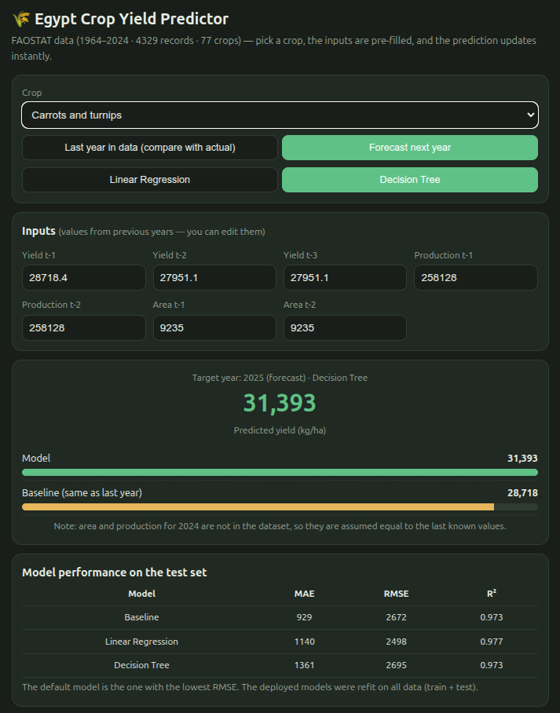

# 🌾 CropWise — Egypt Crop Yield Prediction

> **Data Science Final Project 2026 — GDG Al-Zaher**

CropWise is a data science project focused on analyzing historical agricultural data in Egypt and predicting crop yield using machine learning.

The project uses historical crop production data from **FAOSTAT** and follows an end-to-end data science workflow, from data collection and exploratory analysis to feature engineering, machine learning, model evaluation, and an interactive prediction interface.

---

## 📌 Project Overview

Agricultural yield is influenced by many factors and can vary across crops and years.

CropWise aims to use historical agricultural patterns to provide a data-driven estimate of crop yield for a selected crop and target year.

The project focuses on:

- Understanding historical crop production and yield patterns in Egypt.
- Exploring relationships between agricultural variables.
- Engineering historical time-series features.
- Building and comparing machine learning models.
- Evaluating prediction performance using standard regression metrics.
- Providing an interactive interface for crop yield prediction.

---

## 🎯 Objectives

The main objectives of CropWise are to:

1. Analyze historical crop production data in Egypt.
2. Identify important patterns and relationships in crop yield.
3. Engineer meaningful historical features for prediction.
4. Build regression models for crop yield prediction.
5. Compare different models against a simple baseline.
6. Analyze model errors and limitations.
7. Provide an accessible interface for generating crop yield predictions.

---

## 📊 Dataset

The project uses agricultural data from:

**FAOSTAT — Crop Production**

- **Geographical scope:** Egypt
- **Historical period:** 1964–2024
- **Records used for modeling:** 4,329
- **Target variable:** `Yield`
- **Target unit:** kg/ha

The dataset contains historical information related to crop yield, production, and harvested area.

### Main Modeling Features

The predictive features are based on historical values, including:

- `Yield_Lag1`
- `Yield_Lag2`
- `Production_Lag1`
- `Area_Lag1`
- `Yield_RollingMean_3Y`
- `Area_Growth_Lag1`
- `Production_Growth_Lag1`

Crop identity (`Item`) is also used as a categorical feature.

> The project uses historical features to avoid using same-year production or harvested-area information that would introduce data leakage.

---

## 🔬 Data Science Workflow

The project follows an end-to-end workflow:

```text
Data Collection
      ↓
Data Quality Check
      ↓
Exploratory Data Analysis
      ↓
Visualization & Insights
      ↓
Feature Engineering
      ↓
Preprocessing
      ↓
Baseline Model
      ↓
Linear Regression
      ↓
Decision Tree Regression
      ↓
Model Evaluation
      ↓
Error Analysis
      ↓
Model Comparison
      ↓
Prediction Interface
```

---

## 🤖 Machine Learning Models

Three approaches were evaluated:

**1. Persistence Baseline**

The baseline predicts the current year's yield using the previous year's yield.
```text
Predicted Yield = Previous Year's Yield
```
This provides a simple reference point that machine learning models must improve upon.

**2. Linear Regression**

Linear Regression was used to model relationships between historical agricultural features, crop identity, and current-year yield.

**3. Decision Tree Regression**

A Decision Tree Regressor was used to capture non-linear relationships between the historical features and crop yield.

---

## 📈 Model Evaluation

The models are evaluated using:

- MAE — Mean Absolute Error
- MSE — Mean Squared Error
- RMSE — Root Mean Squared Error
- R² — Coefficient of Determination

The evaluation also includes:

- Actual vs. predicted values
- Residual analysis
- Error analysis by crop
- Error analysis by yield level
- Worst prediction cases
- Feature importance
- Model comparison

---

## 🖥️ CropWise Prediction Interface

CropWise also includes an interactive interface where users can select a crop and work with historical agricultural inputs to generate a yield prediction.



The interface provides:

- Crop selection
- Historical yield inputs
- Historical production and area inputs
- Model prediction
- Baseline comparison
- Model performance information

The prediction is presented in kg/ha.

---

## 📁 Project Structure

```text
CropWise/
│
├── Raw Data/
│   └── Original FAOSTAT dataset
│
├── Processed Data/
│   └── Prepared datasets used throughout the project
│
├── Notebook/
│   ├── Data_Check.ipynb
│   ├── EDA.ipynb
│   ├── Preprocessing_Data.ipynb
│   ├── Visualization_and_Insights.ipynb
│   ├── Linear_Regression_Model.ipynb
│   ├── Decision_Tree_Model.ipynb
│   └── Final_Model_Analysis.ipynb
│
├── API/
│   ├── crop_yield_app.html
│   ├── model.json
│   ├── README.md
│   ├── test_data.csv
│   ├── train_data.csv
│   └── train_model.py
│
└── README.md
```

---

## 📓 Notebooks

The notebooks document the project step by step:

| Notebook | Description |
|----------|-------------|
| `Data_Check.ipynb` | Data loading, filtering, quality checks, and dataset preparation |
| `EDA.ipynb` | Exploratory data analysis |
| `Preprocessing_Data.ipynb` | Feature engineering and preprocessing |
| `Visualization_and_Insights.ipynb` | Agricultural trends, visualizations, and insights |
| `Linear_Regression_Model.ipynb` | Linear Regression modeling and evaluation |
| `Decision_Tree_Model.ipynb` | Decision Tree Regression and error analysis |
| `Final_Model_Analysis.ipynb` | Final model comparison, tuning, and analysis |

---

## 🌱 Key Project Insights

- The analysis shows that recent historical yield is a strong predictor of current crop yield.
- The persistence baseline is therefore a strong reference model, while machine learning models can provide additional predictive improvements, particularly when historical patterns contain larger changes.
- The project also highlights an important modeling challenge: absolute prediction errors can be substantially larger for crops with naturally higher yield scales.
- These findings demonstrate why model evaluation should consider multiple metrics rather than relying on a single performance measure.

---

## ⚠️ Limitations

The current project is based primarily on historical agricultural production data.

It does not currently include external variables such as:

- Weather conditions
- Rainfall
- Temperature
- Soil characteristics
- Fertilizer usage
- Irrigation conditions
- Pest or disease information

Therefore, the predictions should be interpreted as data-driven estimates based on historical patterns, rather than causal agricultural forecasts.

---

## 🚀 Future Work

Future versions of CropWise could improve prediction capabilities by incorporating:

- Weather and climate data
- Rainfall and temperature information
- Soil and irrigation data
- Fertilizer and agricultural input data
- More advanced ensemble models
- Crop-specific models
- Additional external agricultural and socioeconomic variables

---

## 👥 Team

CropWise was developed as a collaborative three-member Data Science team. 

**Team Members:**
- **Mohamed Dahi**
- **Shorouk**
- **Shams**

> The team collaborated across data analysis, machine learning, software integration, and project presentation.

---

## 📚 Data Source

**FAOSTAT** — Food and Agriculture Organization of the United Nations

The agricultural dataset used in this project was obtained from FAOSTAT's Crop Production data.

---

## 🛠️ Technologies

- Python
- Pandas
- NumPy
- Matplotlib
- Seaborn
- Scikit-learn
- Jupyter / Google Colab
- HTML / Web Interface
- GitHub

---

## 📌 Project Status

**Completed** — Data Science Final Project 2026

The project includes the complete data science workflow, machine learning models, model evaluation, and an interactive prediction interface.

---

## ⭐ Acknowledgment

This project was developed as part of the GDG Al-Zaher Data Science 2026 Final Project.